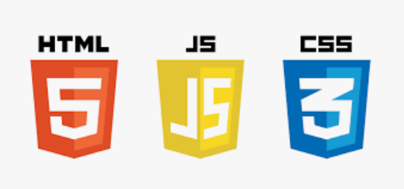

# Welcome to my Website README page

# [My Website](http://www.dazl.ie)

<ul class="navlist">
                <li><a href="#about">About Me</a></li>
                <li><a href="#design">Design</a></li>
                <li><a href="#journey">Journey</a></li>
                <li><a href="#validation">Validation</a></li>
                <li><a href="#tools">Tools</a></li>
                <li><a href="#course">Course</a></li>
                <li><a href="#books">Books</a></li>
                <li><a href="#influences">Influences</a></li>
            </ul>

Hi! My name is Graham. In this README page were you will find out a little about me, my website, my coding journey, my projects and who has influenced me in my development.

# About.

After 20 years in my previous career (healthcare) During the pandemic I decided I needed a change, and I found coding, I am currently self-learning how to develope & design web-sites,
this self-learning is done through on-line tutorials and Youtube videos(links below),
In September 2022 i will be taking this development further by starting
a Professional Diploma course in Full Stack Software Developement with University College Dublin/Code Institute.

# Design.

## <b>Favicon:</b>
To finish off the design of this website, I added a favicon of my own design.

# Journey.

I am very new to coding and have no tech background. Only in August 2022, my wife came across an ad for a Full Stack developer course with University College Dublin and Code Institute, after a little research and doing the 5 day challenge, I became additted and couldnt get enough and I havent looked back since.

# Validation
To ensure the functionality of this project I had 3 tasks.
1. HTML Validation
<input type="checkbox" input checked>
2. CSS Validation
<input type="checkbox" input checked>
3. Lighthouse Accessibility
<input type="checkbox" input checked>

The results of these test are shown below:
<ul>
<li>HTML <ul style="list-style-type:circle"><li>No errors returned on W3C HTML validator</li></ul>
</li>
<li>CSS <ul style="list-style-type:circle"><li>No errors returned on W3C CSS validator</li></ul>
</li>
<li>Accessibility <ul style="list-style-type:circle"><li>On website inspection, lighthouse results are shown below</li></ul>
</li>
</ul>

# Tools

This website uses HTML5, CSS3 and Javascript.

As well as the Code Institute course content, and as with my projects, I got inspiration from some
online tutorials and videos and also books such as  books from Mike McGraths and video tutorials from Mike Dane.

At times I found Javascript challenging and I needed to dig deep into my resourses, thankfully there are so many online tutorials out there to help.

The India based YouTube channel'The WebShala'was of great help on my projects with so many helpful and inspiring tutorials. My thanks to you all.

### Font Awesome [Website](https://fontawesome.com/search)
### Boxicons [Website](https://boxicons.com/)
### Github [Website](https://github.com/)
### Slack [Website](https://slack.com/intl/en-ie/)

# Course

## Professional Diploma in Full Stack Software Development
### University College Dublin [Website](https://www.ucd.ie/professionalacademy/why-ucd-professional-academy/)

### Code Institute [Website](https://codeinstitute.net/ie/full-stack-software-development-diploma/?utm_term=code%20institute&utm_campaign=CI+-+IRL+-+Search+-+Brand&utm_source=adwords&utm_medium=ppc&hsa_acc=8983321581&hsa_cam=14304747355&hsa_grp=128775288169&hsa_ad=595155717776&hsa_src=g&hsa_tgt=kwd-342001843376&hsa_kw=code%20institute&hsa_mt=p&hsa_net=adwords&hsa_ver=3&gclid=Cj0KCQjwnvOaBhDTARIsAJf8eVOdV0BAxB5DwdTrFB9AvR5tJ73tLtvCsSeHDsSSq9e1gNbiXiNLTZQaAkyKEALw_wcB)

# Books

### Mike McGrath - HTML, CSS & Javascript (Special Edition) [Amazon](https://www.amazon.co.uk/HTML-CSS-JavaScript-easy-steps/dp/184078878X/ref=asc_df_184078878X/?tag=googshopuk-21&linkCode=df0&hvadid=430989472982&hvpos=&hvnetw=g&hvrand=4859645684734044070&hvpone=&hvptwo=&hvqmt=&hvdev=c&hvdvcmdl=&hvlocint=&hvlocphy=20487&hvtargid=pla-921516488553&psc=1&th=1&psc=1&tag=&ref=&adgrpid=97419294662&hvpone=&hvptwo=&hvadid=430989472982&hvpos=&hvnetw=g&hvrand=4859645684734044070&hvqmt=&hvdev=c&hvdvcmdl=&hvlocint=&hvlocphy=20487&hvtargid=pla-921516488553)

### Jon Duckett - HTML & CSS, design and build websites [Amazon](https://www.amazon.co.uk/HTML-CSS-Design-Build-Websites/dp/1118008189/ref=asc_df_1118008189/?tag=googshopuk-21&linkCode=df0&hvadid=310831942794&hvpos=&hvnetw=g&hvrand=9245307914514372249&hvpone=&hvptwo=&hvqmt=&hvdev=c&hvdvcmdl=&hvlocint=&hvlocphy=20487&hvtargid=pla-425752469964&psc=1&th=1&psc=1)

### Jon Duckett - JAVASCRIPT & JQUERY interactive front-end web development [Amazon](https://www.amazon.co.uk/JavaScript-JQuery-Interactive-Front-End-Development/dp/1118531647)

# Influences

### Mike Dane [Website](https://www.mikedane.com/) [YouTube](https://www.youtube.com/c/GiraffeAcademy)

### TiffinTech [Youtube](https://www.youtube.com/c/TiffInTech/about)

### Tahmid Ahmed [Youtube](https://www.youtube.com/channel/UC6iO-h3n4adFsp3krxznqHg/featured)

### The WebShala [YouTube](https://www.youtube.com/@TheWebShala)

